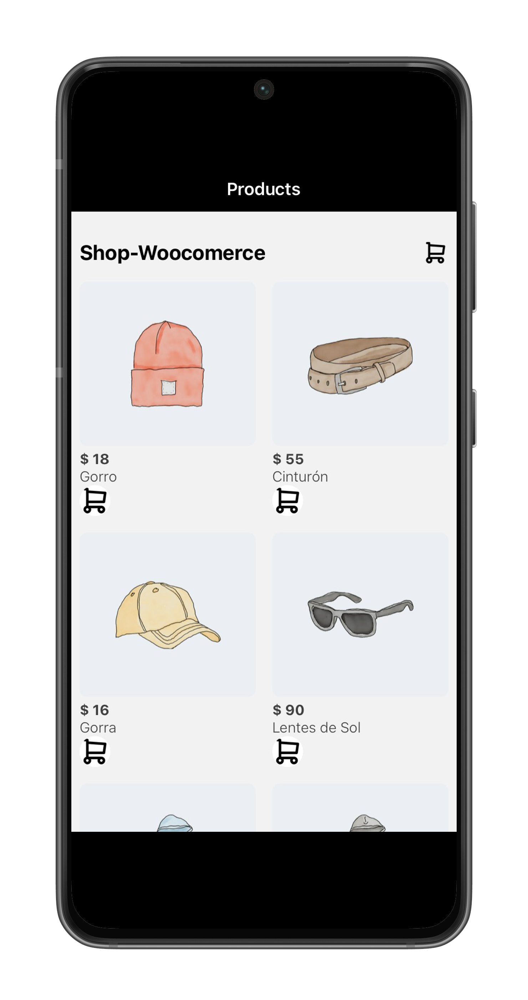

# Shop-Woocommerce-App

This project was created with React Native & Woocommerce the project in WordPress is not yet available in production for testing was used [Local WP](https://localwp.com) with Live Link to simulate a production url.




## Built With 🚀


## Getting started  🔧

Clone the repository

```sh
npm clone https://github.com/mauricioyair/Shop-Woocommerce-App.git
```

Install dependency
```sh
npm install
```

In the project directory, you can run:

```sh
expo start
```
